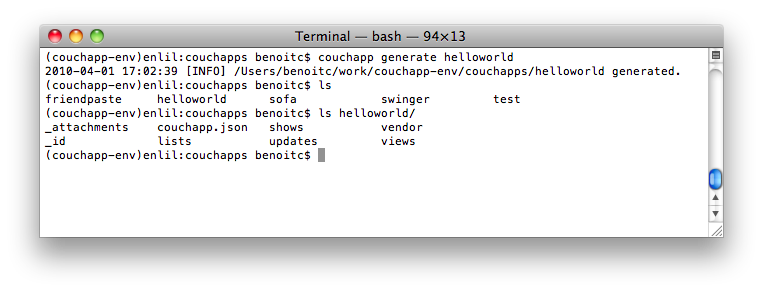
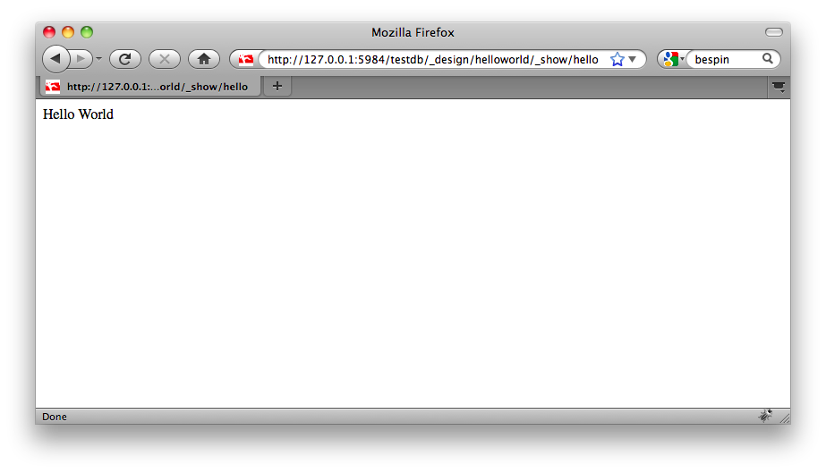

title: Getting Started

#Getting Started

In this tutorial you will learn how to create your first CouchApp (embedded applications in [CouchDB](http://couchdb.apache.org)) using the `couchapp` script.

##1. Generate your application

couchapp provides you the `generate` command to initialize your first CouchApp. It will create an application skeleton by generating needed folders and files to start. Run:

    $ couchapp generate helloworld
   

##2. Create a show function

To display our hello we will create a show function. 

    $ cd helloworld/
    $ couchapp generate show hello
    
Here the generate command create a file named `hello.js` in the folder shows. The content of this file is :

    function(doc, req) {  

    }
    
which is default template for `show` functions.

For now we only want to display the string "Hello World". Edit your show function like this:

    function(doc, req) {
        return "Hello World";
    }
    
##3. Push your CouchApp

Now that we have created our basic application, it's time to **push** it to our CouchDB server. Our CouchDB server is at the url http://127.0.0.1:5985 and we want to push our app in the database testdb:

    $ couchapp push testsb
    

Go on http://127.0.0.1:5984/testdb/_design/helloworld/index.html, you will see:

##4. Clone your CouchApp

So your friend just pushed the helloworld app from his computer. But you want to edit the CouchApp on your own computer. That's easy, just **clone** his application:

    $ couchapp clone http://127.0.0.1:5984/testdb/_design/helloworld helloworld

This command fetch the CouchApp `helloworld` from the remote database of your friend.

Now you can edit the couchapp on your own computer.
